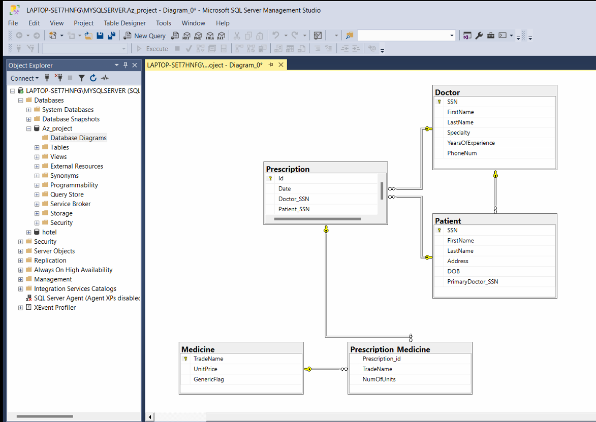

# SQL Lab Project

This repository contains a university-level database lab project focused on SQL querying, database design, and relational data management. As an optional bonus, a basic Django web interface was developed to demonstrate CRUD operations on the `Doctor` table.

## 📘 Project Overview

The core of the project is a medical database that includes tables for doctors, patients, prescriptions, and medicines. SQL scripts were written to create the schema, insert data, and answer a set of complex queries related to prescriptions and medication usage.

### Bonus Part (Web Interface)
To extend the functionality, a lightweight web interface was built using Django to manage `Doctor` records. It includes create, read, update, and delete (CRUD) operations.

## 🛠️ Technologies Used

- **SQL** – Database schema design and query writing
- **Django** – Web application framework for the CRUD UI
- **SQLite** – Backend database for Django demo
- **HTML/CSS (basic)** – Django templating for the interface

## 🎯 Objectives

- Practice relational database design and normalization
- Write advanced SQL queries involving filtering, grouping, and subqueries
- Design a web-based interface for database interaction using Django

## 🗂️ Entity-Relationship Diagram

Below is the ERD representing the structure of the database used in this project:



## 🚀 How to Run the Django App

> _Optional: Only required to view or test the bonus part._

1. Clone the repo and enter the directory:
   ```bash
   git clone https://github.com/your-username/sql-lab-project.git
   cd sql-lab-project
